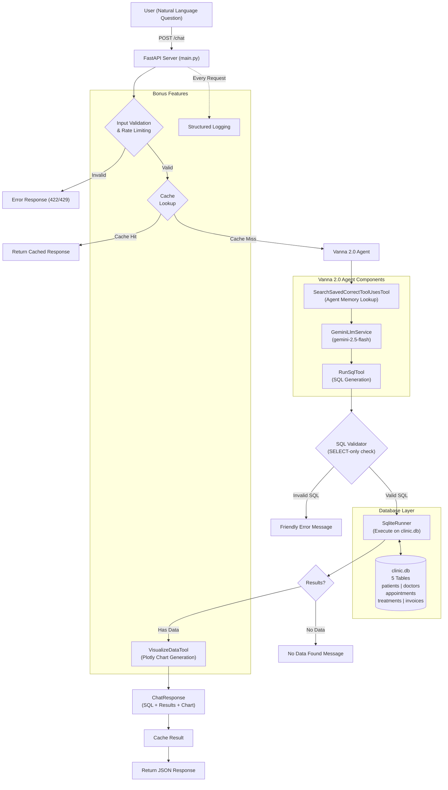
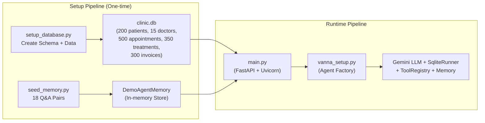

# Clinic Assistant

A natural language to SQL system for clinic management data, leveraging **Vanna 2.0** and **Google Gemini** to translate user queries into SQL, execute them, and return results with interactive visualizations.


## Architecture Overview





**Components:**
- **Google Gemini (gemini-2.5-flash)** -- LLM for natural language to SQL translation
- **Vanna 2.0 Agent** -- Orchestrates LLM, tools, memory, and user context
- **SQLite** -- Clinic management database with 5 tables
- **FastAPI** -- REST API with validation, caching, rate limiting, and logging
- **DemoAgentMemory** -- Stores 18 pre-seeded Q&A pairs for improved accuracy

## LLM Provider

**Google Gemini** — using `GeminiLlmService` from Vanna 2.0.

## Prerequisites

- Python 3.11.9
- Google AI API key ([Get one here](https://aistudio.google.com/apikey))

## Setup Instructions

### 1. Clone and enter the project directory

```bash
cd NL2SQL
```

### 2. Create and activate a virtual environment

```bash
python3 -m venv venv
source venv/bin/activate   # macOS/Linux
# venv\Scripts\activate    # Windows
```

### 3. Install dependencies

```bash
pip install -r requirements.txt
```

### 4. Configure environment variables

Create a `.env` file (or edit the existing one):

```
GOOGLE_API_KEY=your_google_api_key_here
```

### 5. Create the database

```bash
python setup_database.py
```

Output:
```
Created 200 patients, 15 doctors, 500 appointments, 350 treatments, 300 invoices
```

### 6. Seed the agent memory

```bash
python seed_memory.py
```

This pre-loads 18 question-SQL pairs so the agent has examples to learn from.

### 7. Start the API server

```bash
python main.py
# or
uvicorn main:app --host 0.0.0.0 --port 8000 --reload
```

The server will automatically:
- Initialize the Vanna 2.0 Agent
- Seed agent memory (since DemoAgentMemory is ephemeral)
- Start listening on `http://localhost:8000`

## API Documentation

### POST /chat

Ask a natural language question about clinic data.

**Request:**
```bash
curl -X POST http://localhost:8000/chat \
  -H "Content-Type: application/json" \
  -d '{"question": "How many patients do we have?"}'
```

**Response:**
```json
{
  "message": "Found 1 result(s).",
  "sql_query": "SELECT COUNT(id) FROM patients",
  "columns": ["COUNT(id)"],
  "rows": [[200]],
  "row_count": 1,
  "chart": null,
  "chart_type": null,
  "error": null,
  "cached": false,
  "timestamp": "2026-04-13T17:42:08.126135"
}
```

**More examples:**

```bash
# Revenue by doctor (generates bar chart)
curl -X POST http://localhost:8000/chat \
  -H "Content-Type: application/json" \
  -d '{"question": "Show revenue by doctor"}'

# Monthly trend (generates line chart)
curl -X POST http://localhost:8000/chat \
  -H "Content-Type: application/json" \
  -d '{"question": "Revenue trend by month"}'

# Top patients
curl -X POST http://localhost:8000/chat \
  -H "Content-Type: application/json" \
  -d '{"question": "Top 5 patients by spending"}'
```

### GET /health

Health check endpoint.

**Request:**
```bash
curl http://localhost:8000/health
```

**Response:**
```json
{
  "status": "ok",
  "database": "connected",
  "agent": "active",
  "agent_memory_items": 18,
  "cache_size": 0,
  "timestamp": "2026-04-13T17:42:00.205531"
}
```

## Project Structure

```
├── .env                  # Environment variables (GOOGLE_API_KEY)
├── requirements.txt      # Python dependencies
├── setup_database.py     # Creates clinic.db with schema + dummy data
├── vanna_setup.py        # Vanna 2.0 Agent factory (shared config)
├── seed_memory.py        # Pre-seeds 18 Q&A pairs into agent memory
├── sql_validator.py      # SQL validation (SELECT-only enforcement)
├── main.py               # FastAPI app with /chat and /health endpoints
├── test_queries.py       # Test script for 20 questions
├── clinic.db             # SQLite database (generated)
├── RESULTS.md            # Test results documentation
└── README.md             # This file
```

## Database Schema

| Table | Rows | Description |
|-------|------|-------------|
| `patients` | 200 | Patient demographics (name, email, phone, DOB, gender, city) |
| `doctors` | 15 | Doctor profiles across 5 specializations |
| `appointments` | 500 | Patient-doctor appointments over 12 months |
| `treatments` | 350 | Treatments linked to completed appointments |
| `invoices` | 300 | Billing with Paid/Pending/Overdue statuses |

## Bonus Features

### 1. Chart Generation (Plotly)
Automatic chart generation based on query context:
- **Bar charts** for comparisons (revenue by doctor, cost by specialization)
- **Line charts** for trends (monthly revenue, registration trends)
- **Pie charts** for distributions (percentage breakdowns)

Charts are returned as Plotly JSON specs in the `chart` field.

### 2. Input Validation
- Minimum 3 characters, maximum 1000 characters
- Whitespace normalization
- Pydantic model validation with clear error messages

### 3. Query Caching
- In-memory cache with 5-minute TTL
- Max 100 cached entries
- Repeated questions return instantly with `"cached": true`

### 4. Rate Limiting
- 20 requests per minute per IP address
- Returns HTTP 429 when exceeded

### 5. Structured Logging
- Timestamp, level, logger name, and message
- Logs: requests, response times, cache hits, SQL generation, errors

## SQL Validation

All AI-generated SQL is validated before execution:
- **SELECT only** — rejects INSERT, UPDATE, DELETE, DROP, ALTER, etc.
- **No dangerous keywords** — blocks EXEC, xp_, sp_, GRANT, REVOKE, SHUTDOWN
- **No system tables** — blocks sqlite_master access
- **Single statement** — rejects semicolon-separated multi-statements

## Test Results

**Score: 20/20 passed** — See [RESULTS.md](RESULTS.md) for detailed results.

All 20 test questions generated valid, executable SQL. 18/20 returned fully correct results. 2/20 had minor case-sensitivity issues with status enum values (the SQL structure was correct but used different casing than stored values).
